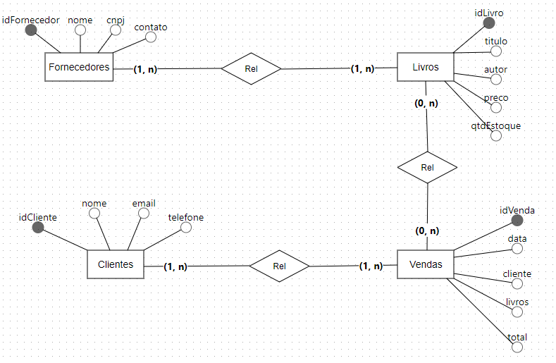
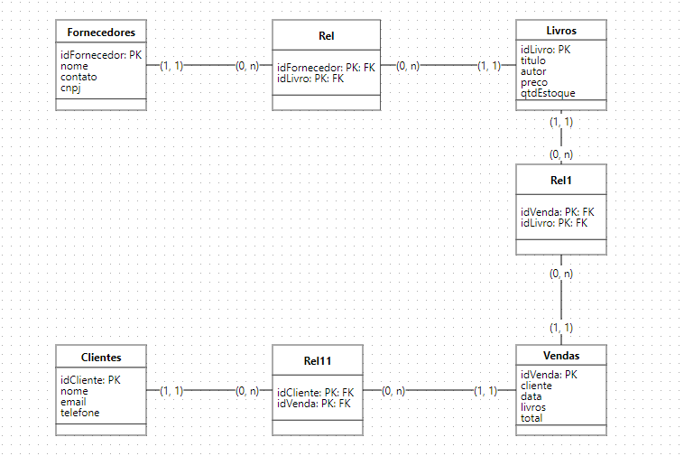

# BookStore

Esse projeto consiste em um banco de dados relacional, que suporta operações básicas de um sistema de gerencimaneto de livraria.

## Projeto de Banco de Dados - Bookstore

Modelos para implementação no banco de dados.

### Modelagem Conceitual

### Modelagem Lógica

